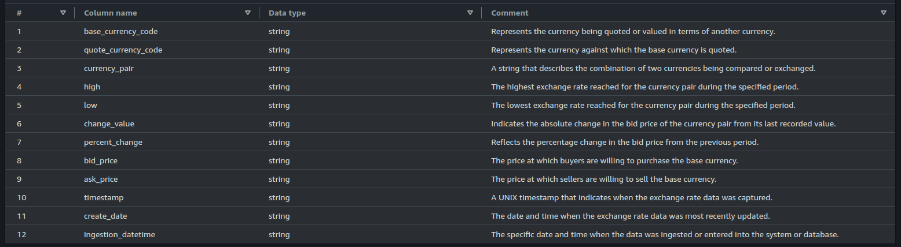

# AWS Serverless Data Pipeline

## Objectives

The goal of this project is to build a Serverless, IaC and Low Cost data pipeline on AWS to extract data from a external API, process throw a Datalake and provide this information to downstream users.

## Getting Started

### Prerequisites

Before you begin, ensure that you have the following tools installed:

- Terraform CLI: Make sure you have the Terraform CLI installed.
- AWS CLI: Also, ensure that you have the AWS CLI installed with a configured profile.

### First Steps

After cloning the repository, follow these steps to deploy the infrastructure using Terraform:

- Initialize Terraform:

    `terraform init`

- Plan your changes:

    `terraform plan`

- Apply the changes (specify the path to your `.tfvars` file):

    `terraform apply -var-file={path/to/.tfvars}`

- [Optional] To destroy the infrastructure (specify the path to your `.tfvars` file):

    `terraform destroy -var-file={path/to/.tfvars}`

Remember to replace `{path/to/.tfvars}` with the actual path to your `.tfvars` file.

## Architecture

This repository contains the Terraform configuration files for setting up a serverless data pipeline infrastructure as code on AWS. The architecture leverages various AWS services to create a scalable, cost-effective, and efficient data processing workflow.

### Diagram


### Components

1. **Datalake**

    AWS S3 Storage as a central repository to store the data.
    - raw: This is where data is ingested in its original, unprocessed form.
      - partition: currency and date
    - curated: Raw data processed, cleaned, and transformed

2. **Data Catalog**

    AWS Glue Databases metadata repository that stores information about data, such as table definitions, schemas, and locations. This enable the use of Athena to query the data from the Datalake.
    - currency_exchange_raw (raw)
    - currency_exchange (curated)

3. **Orchestration**

    AWS Step Functions orchestrator to coordinate the ETL (Extract, Transform, Load) process. Step Functions trigger AWS services such as Lambda Functions and Start Athena Query to process the data.

4. **Data Processing**

    AWS Lambda Serverless Function to retrieve data from external API or sources and store on the Raw Layer of the Datalake, without managing servers.

    AWS Athena to query and process raw data. Using the Trino engine, Athena can clean, transform, and structure the raw data into a more organized curated layer, without needing a separate server or database. It's serverless, scalable, and supports complex queries for data transformation.

5. **Data Provisioning**

    AWS Athena is one manner to users access and query available data. The AWS Glue Catalog provides metadata and schema information, allowing Athena to understand and process the data stored in S3 directly using SQL queries.

6. **Trigger**

    AWS EventBridge with a **cron rule** triggers Step Functions on a set schedule. This automates the start of a data pipeline at regular intervals, ensuring that ETL processes run on time without manual triggers. The chosen schedule is **every 15 minutes, between 12:00 PM and 08:59 PM on the working days**, because this is the period when the currency exchange quotation occurs.

7. **Observability**

    AWS CloudWatch provides observability for the data pipeline by monitoring its performance, logging key events, and tracking metrics such as task duration, errors, or resource usage. It helps detect issues, set alarms, and visualize pipeline health in real time, ensuring smooth operation and quick troubleshooting.

8. **Permission**

    IAM Role ensures that the services can only access permitted resources by defining specific permissions. It grants the necessary access rights to the services while restricting access to resources outside of those permissions, enhancing security and compliance.

### Observations

1. **Raw Partitions**

    The raw layer has two partitions: **currency** and **date**. Running the `MSCK REPAIR TABLE` command in AWS Athena is necessary to update the partitions in the Glue Data Catalog, allowing access to data in newly added partitions. Because of this the step Raw Partitions on the Step Functions.

2. **Iceberg Table**

    The curated layer is implemented using Iceberg table. Iceberg tables on AWS Athena are a type of open table format that supports advanced data management features. They allow to perform merge operations, which means it possible efficiently insert, update, or delete data in the table.

## Application

The application chosen to extract data from a external API is quotation currency exchange. The chosen API is the [Awesome Api](https://docs.awesomeapi.com.br/api-de-moedas). The quotation currency exchange process involves the buying and selling of currencies, and it’s essential for businesses engaged in international trade or investment. Here's a breakdown of how it works and why it's crucial:

### Currency Exchange Process

1. **Quotation**: Currency exchange rates are quoted based on the relative value of one currency against another. For example, if the EUR/USD exchange rate is 1.10, it means 1 Euro is equivalent to 1.10 US Dollars.

2. **Bid and Ask Prices**: The exchange rate is typically quoted with two prices:
   - **Bid Price**: The price at which the market (or your broker) will buy a currency.
   - **Ask Price**: The price at which the market (or your broker) will sell a currency.
   - The difference between the bid and ask prices is known as the spread.

3. **Market Orders**: Transactions can be executed at the current bid or ask price. Businesses may need to buy or sell currencies at these rates depending on their needs.

4. **Settlement**: After agreeing on the exchange rate, the actual conversion of currency takes place, and the transaction is settled. This might involve transferring funds between bank accounts or through other financial instruments.

### Importance for Businesses

1. **Cost Management**: For businesses dealing with foreign suppliers or customers, exchange rates directly affect the cost of goods and services. Regularly updated exchange rate information helps in budgeting and pricing.

2. **Hedging**: Businesses can use financial instruments to lock in exchange rates to protect against adverse currency movements. This is especially important for long-term contracts or payments.

3. **Profit Margins**: Fluctuations in exchange rates can impact profit margins. Access to real-time information helps businesses make informed decisions to maximize profitability.

4. **Cash Flow Planning**: Knowing the current exchange rates allows businesses to manage their cash flow effectively by timing their transactions to get the best rates.

5. **Competitive Advantage**: Businesses that keep track of currency movements can gain a competitive edge by optimizing their pricing strategies and negotiating better terms with international partners.

In summary, having access to up-to-date currency exchange information allows businesses to make more informed financial decisions, manage risks, and improve their overall financial health.

## Accessing the Data

### Data Schema and Dictionary

Bellow is possible to understand the schema and data definition based of the AWS Glue Catalog of the Raw and Curated layer. It is possible to observe that curated layer has more meaningful columns names and descriptions and is going to be the real data collected by downstream users.

#### currency_exchange_raw

**Table**: currency_exchange (External Table)


#### currency_exchange

**Table**: currency_exchange (Iceberg Table)



### Querying

Using the AWS Athena is possible to observe the data with the following queries.

#### currency_exchange_raw

```sql
select * from currency_exchange_raw.currency_exchange
```

#### currency_exchange

```sql
select * from currency_exchange_curated.currency_exchange
```